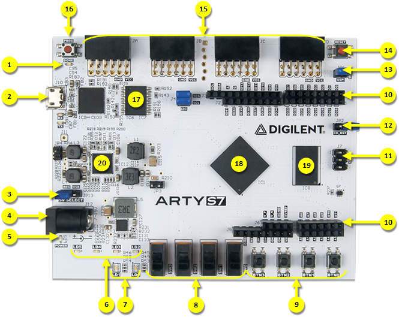
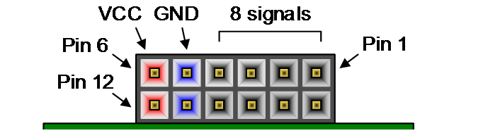
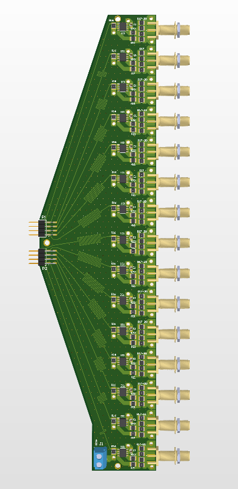
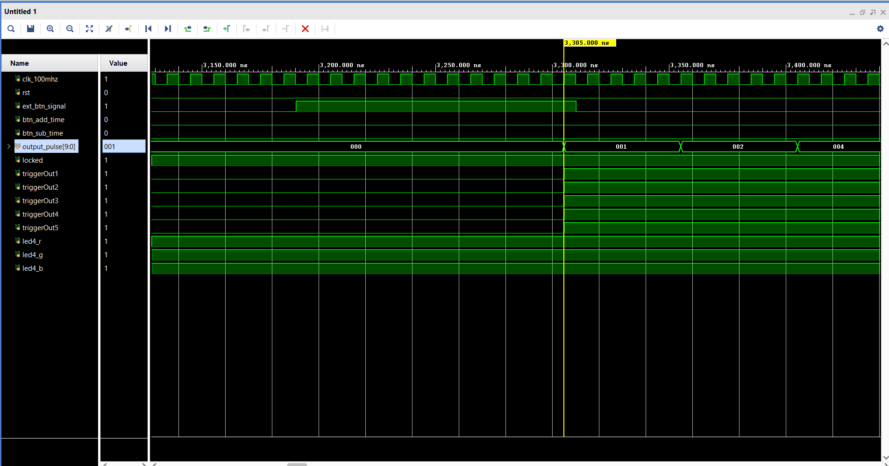
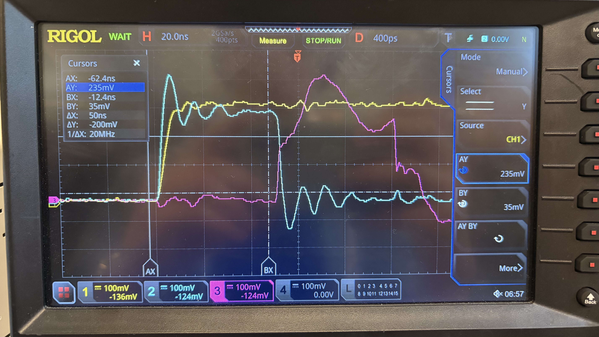

# BaPSF FPGA Pulse Propagation System

High-speed FPGA-based pulse generation system for Stark spectroscopy experiments at the Basic Plasma Science Facility (BaPSF).

Built on the Arty A7-100T FPGA, the system generates precisely timed nanosecond pulses across 10 output channels for synchronized triggering and pulse propagation experiments.

Features:
- 10 synchronized output channels
- Adjustable pulse width from 45–55 ns
- 0.5 ns timing resolution
- Hardware-tested on oscilloscope
- FPGA-generated global trigger outputs
- MMCM-based dynamic timing control

## How To Use:
On the Arty A7 100T dev board:

    BTN 0: Reset
    BTN 1: Trigger
    BTN 2: Increase 50 ns default pulse up by 0.5 ns (Max 55 ns pulse)
    BTN 3: Decrease 50 ns default pulse up by 0.5 ns (Min 45 ns pulse)
    IO 0 - IO 4 (Number 10 in the image): Outputs for the external triggers (laszers, high speed camera, etc ..) 

    JC PMOD (2rd from the left on the side of dev board) Using all 8 pins for outputs 7 through 14
    JB PMOD (3rd from the left on the side of dev board) Using 7 pins for outputs 0 through 6

## PCB:

    This custom PCB plugs into the Arty A7's PMOD headers and allows the signal to rapidly trigger powerful MOSFETs. The PCB is a 4 layer PCB that takes 15 inputs from an Arty A7's PMOD connectors, and via length and impedance matched traces, passes the signal through 15 gate drivers. The gate drivers boost the signal and (through 4 200 ohm resistors in parallel (for 50 ohms)) output it to their respective SMA connector. 

## Purpose:
FPGA needs to trigger 10 copper cores acting as transmission lines one after the other, providing each with around a 50 ns pulse.
Overall, the project will be used to measure the strength of electric fields using Stark Spectroscopy in the LAM processing lab at the BaPSF. 

Used for a high-speed multi-channel pulse propagation system using an Arty A7-100T FPGA to generate precisely timed pulses (around 50 ns) that sequentially switch MOSFET-driven coils/channels. User can change pulse in range of 45 - 55 ns in 0.5 ns increments / decrements. The FPGA is able to trigger other equipment in the lab
    JC PMOD (2nd from the left on the side of dev board) Using all 8 pins for outputs 0 through 7
    JB PMOD (3rd from the left on the side of dev board) Pins 1 & 2 used for outputs 8 & 9

## Technical Highlights

- Verilog/SystemVerilog FPGA design
- Multi-channel pulse sequencing
- MMCM dynamic clock reconfiguration
- Clock-domain synchronization
- Metastability mitigation
- Timing-critical digital design
- Vivado simulation and synthesis
- Oscilloscope-based hardware validation
- Xilinx Artix-7 FPGA development
- Constraint management with XDC

## Images

Waveforms captured from testbench ran in Xilinx Vivado 

Physically testing the FPGA with an oscilloscope to make sure the real world performance matches the simulation. Additionally, there were concerns that the traces on the FPGA PCB dev board could have parasitic capacitance and EMI at such fast frequenies. 

